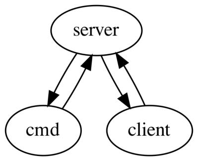
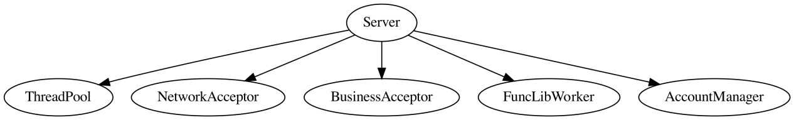
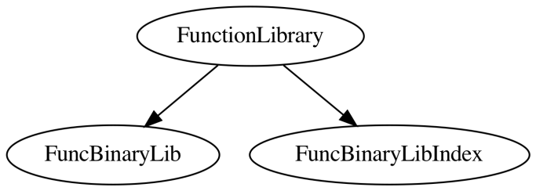
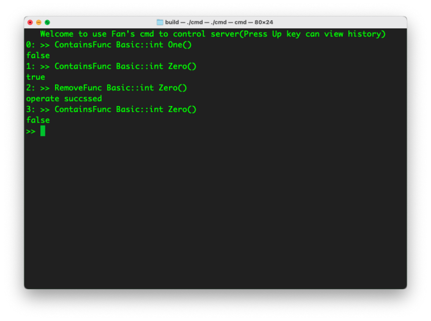

* # 函数服务器项目说明

  本文档主要用于说明函数服务器项目目录下的代码结构，间或插入一些当前项目相关情况的说明，方便后来者快速熟悉项目结构。

  一．项目概况

  函数服务器项目的子项目按照功能来分，主要有三个：server、cmd和client。server是进行函数调用及相关功能的后端服务器，cmd是输入命令发起管理server请求的前端，client是借助客户端开发库发起函数调用请求的前端，相互之间通过网络来传递信息。

  开发初始以源码跨平台为目标。需要考虑跨平台问题的部分是网络和cmd的UI显示部分的代码。网络部分选用Asio跨平台网络库来解决。UI显示部分尚未支持跨平台，目前仅支持macOS。现在这部分的实现是使用的*nix系统自带的ncurses TUI(Text-based user interface)库，所以在Windows上cmd无法编译过去。但在网络上搜索的过程中，看到了有人已经开发出Windows上类ncurses的库，所以可以通过一些修改支持。然后因为键盘按键编码的不同，此次只支持了macOS。

  目前经过编译、测试的是macOS环境下的server、client和cmd。构建项目需要在src目录下新建名为include的文件夹，将Asio库的代码文件放在此目录下，之后使用CMake进行构建，src目录下有CMakeLists.txt来控制构建过程，想要了解详细构建过程可以去看这个文件。

  接下来我们依次介绍server、cmd和client。

  二．server

  server的运行依靠一个叫Server的类，代码在src/Server/Server中，Server类主要包含以上五个数据成员。从名字来看都比较好理解。

  Server在运行时，当有网络连接接入时，使用的是NetworkAcceptor设置的回调来接待接入的连接，然后其将接入的连接交给BusinessAcceptor，让BusinessAcceptor接待处理具体业务上的东西。BusinessAcceptor从AccountManager处查询登录用户的类型，来转接到不同的Service，分别是AdminService和ClientService，来处理用户接下来产生的请求。这些产生的请求中，有的是函数库(FuncLib）相关的，有的是账号(Account)相关的...Service从通信中获取请求的参数，将其交给FuncLibWorker、AccountManager这样的worker来做：worker产生要执行的任务交给ThreadPool去执行。worker产生的任务内部，有互斥量来保证同一资源在多用户情况下工作的正确性。这里的资源说的是函数库、账号信息。

  在线程池里，每个任务内部执行完具体的工作后，比如调用某个函数后，会去执行各自的后续流程，例如打印访问日志、生成和发送内容响应用户的请求。这部分使用协程来实现，需要代码的阅读者对协程的概念比较熟悉，但总体的逻辑如上面所述，可以以此逻辑去理解代码。

   

  上面说了服务器端的内部逻辑，接下来说一下各个端和外部通信的部分——整个项目网络的相关部分。

  前面说过，项目中采用的网络库是Asio，实际使用中，我没有直接使用Asio中的类型，而是自定义类型对用到的Asio类型包了一层。这些类型分别是src/Network目录下的IoContext、NetworkAcceptor、Socket。这样有很多好处。一是可以mock原来的类型，方便的进行测试，只要你在包含的头文件前面加一句#define MOCK_NET，不用网络，也可以测试服务端的代码。二是可以方便的加入自己想要的操作，Asio的代码虽然可以改但你想去改不是那么容易改，改自己的代码就容易得多。例如在关机命令中，我希望服务器在接到关机命令后IoContext的Run（类似于事件循环）等30秒再返回（本来是立即返回），让别的线程中还在执行的任务尽量可以执行完，我就不需要翻Asio的文档来查能不能实现这样的操作。三是可以帮助理清代码中依赖Asio的一些操作，因为你需要一个个加入包一层的方法，就知道项目中依赖Asio的哪些东西，整理的过程中也可以加入一些方便自己的操作，比如简化获取socket的过程。

   

  然后是网络通信时传输的具体request数据。

  项目里所有请求类型都集中在src/Network/Request里，每个请求类型里包含可选的请求的参数和结果。通信两端是采用JSON作为数据传输格式。通过使用对应的JsonConverter里的Serialize、Deserialize函数特化来将request里的参数、结果与JSON对象互相转换。每当需要添加新的请求类型时，就在此文件里添加相应的请求类型和对应的JsonConverter特化。

  项目中关于JSON的代码主要集中src/Json文件夹下，包含Serialize、Deserialize、JsonObject类型和JSON字符串解析等相关代码。

  以上便是***\*服务\****器的相关代码。下面来说函数服务器的函数相关功能所依托的函数库。

  三．函数库

  函数库是一个包含添加、删除和调用函数等函数管理功能的仓库。函数库中的数据可以跨越多次程序运行使用。其中添加的函数经过编译，最终被存储在硬盘上。由于函数服务器***\*动态\****调用需求（即编译时不知道运行时将要调用的函数类型），而***\*静态\****类型程序语言C++中所有数据（变量、函数）都要求有固定的类型，所以xxx函数调用的类型被统一编译成JsonObject xxx_wrapper(JsonObject args)，用JsonObject来包容参数和返回值类型的动态性，实际调用时就是调用这个wrapper函数。目前支持的参数和返回值类型是在JsonConverter内拥有Serialize和Deserialize函数特化的类型，这两个函数可以将JsonObject和目标类型相互转换。另外，函数库不支持添加模板函数进库。

  函数库的代码在src/FuncLib目录下，其对外暴露的的接口是FunctionLibrary类型。FunctionLibrary主要包含两个部分，FuncBinaryLib和FuncBinaryLibIndex。

  顾名思义，这两部分分别是函数编译后的二进制的库和这些二进制库的索引，这两部分都存储在硬盘上。关于存储部分的细节，后面我们再说。这里的索引的实现采用的是B+树，B+树的Key是函数类型信息（FuncType）按照一定规则组合后的一串字符串，Value中除了包含了函数Binary在FuncBinaryLib中的位置，还包含一些函数的信息——参数名称和称之为summary的注释信息——这些信息是函数搜索时的考察项，之后如果有需要，这部分信息也可以为客户端程序员书写调用程序时提供参考信息。

  

   

  当运行一个函数库命令时，比如调用某个函数，会先在B+树中进行搜索，找到函数Binary的位置信息，然后以这个位置信息去二进制库里找到对应的二进制数据。这是函数库基本的工作流程。

  函数库支持多个函数定义在同一次Add操作中同时添加。由于索引的Key的支持，函数库也支持添加仅返回值类型不同的两个函数类型（类比重载来理解），但要求这样的两个函数定义不在同一次Add中加入，因为如上所述，函数库编译函数定义时会统一返回值、参数类型，在同一个文件里这样的C语言代码是编译不过的，所以会出现这样的限制。

   

  现在来介绍函数库的存储部分，这部分代码在src/FuncLib/Persistence和src/FuncLib/Store目录下，可以理解为实现了将硬盘文件当作内存使用的基础设施。在这部分的设计中有模仿C++内存操作的接口设计，所以可以在一个文件存储里你可以New、Delete对象，像你在内存里的操作一样，只要你在Persistence的ByteConverter里加入对应的转换代码。

  Persistence的意思是持久化，这个文件夹下面的ByteConverter类的不同特化将各种类型的对象转换为字节，方便持久化存储，也可以读出字节，然后将字节转换为对应类型的对象。

  Persistence文件夹下包含了一个DiskPtr的模板类型，这个类型就是硬盘里的指针类型。之所以有这个类型，一方面是因为在编程中对象的实现（或者说定义）中，很少没有指针关系的存在，比如std::string、std::vector内部都有指针的存在；另一方面，硬盘指针更进一步可以实现对硬盘文件内容的惰性读取，在需要的时候才去读取指针所指向位置的内容，最后只写入读取了的内容。惰性意味着当前的一些信息虽然现在用不到（因为不用读）但要保留下来供之后读的时候用——在这样的时候，使用一个类型封装这些数据和操作是合适的。而C++也支持这样的封装，所以会有了DiskPtr。如果想让某个类型支持这样的惰性读取，就要让DiskPtr侵入类型的内部定义，代替原来内存的指针类型——这时候一个“类型”（打引号是想说：严格来说两个不是同一个类型，但有很大相关度）会出现两个版本，内存中的版本和硬盘中的版本。

  在写这部分程序之前，我已经写了内存中的B+树。要让B+树在硬盘里惰性读取，就需要将DiskPtr侵入到B+树实现的内部。经过修改，我终于将原本内存里的B+树的代码支持了内存和硬盘两个版本。

  Persistence里的TypeConverter，提供将内存版本类型的对象转换为硬盘版本类型的对象的功能。比如有时候我希望先把内存里的B+树建好，然后一次性转换成硬盘里的B+树。

  引入硬盘指针，引入惰性读取，还带来了很多问题需要解决。例如B+树内部动态的新建一个对象时，如何获得文件内部空间的分配。如果多个硬盘指针指向同一个对象，如何保证后读的指针获得指向对象的最新状态。还有类型继承相关的事，一个指向抽象基类类型对象的指针，去读的话，需要读派生类对象。这些在Persistence和Store文件夹包含的代码里都有解答。

  在写这一部分代码的过程中，能感觉到这些东西与内存里的概念有很大的相关性，当时也明确了最终写出来的东西会是个像“硬存”一样的东西。在接下来Store的部分，有些设计我就模仿了C++内存接口的设计。

  File，相当于“硬存”的总管理。当需要New、Delete硬盘里的对象时，都需要使用它。这与我们通常在程序语言里说的的管理文件读写的File类型不一样。需要说明的是，通过File::New出来的对象，如果不手动使用File::Store进行存储，那最终并不会存储到硬盘中的。通过File::Read读出来对象也是如此，不Store的话，硬盘里数据状态不会更新。

  StorageAllocator，就是模仿C++里Allocator设计，管理文件内部的空间分配。值得一提的是，StorageAllocator分配的只是pos_label，并不是具体的存储位置pos_int，只有需要进行读写操作了，才会要StorageAllocator返回具体的位置。这样有个好处，因为所存储的对象里包含了指针（接下来如不特意提起，指针指代的都是硬盘指针），存储的时候指针也要存储，使用了pos_label这一层抽象，存储pos_label，就可以让存储的字节与具体的地址无关。将来对象如果发生了移动（比如进行碎片整理），只要修改StorageAllocator里pos_label对应的pos_int值即可，而不用担心影响别的部分。

  FileCache是为了应对多处指针读取同一位置，在内存中为已读位置建立的缓存。缓存也要处理上面说的“指向抽象基类类型的指针”的问题，为此加入了CacheSearchRoutine，来指定对于某些类型要在缓存中搜索多个类型，比如是派生类型的指针时，基类类型和派生类型都要搜索。另外FileCache也提供了对非对象重要状态的数据设置提供了RegisterSetter的功能。有时候对象会对内部指针所指对象有一些回调要设置，比如B+树里的上层节点需要对下层节点设置回调，如果直接去设置的话，会触发对象读取，惰性读取的效果会大打折扣，所以这类非对象重要状态的数据推荐使用RegisterSetter来注册一个setter，等真正需要读取对象并读取了后，就把这些setter应用上去，从而保证对象状态正确。

  ObjectRelation目录下的代码是为了处理文件内部的对象关系而写。文件内部的对象关系目前是树状的，一个节点对应一个对象。比如有时在操作对象时，只读了对象关系树中上层的节点，就决定删除这部分子树上的对象，这部分可能都没有读，所以需要通过保存的对象关系树来知晓子树上有哪些节点要释放并更新对象关系树，之后可以回收这部分已释放节点对象的硬存空间。

  这些StorageAllocator、ObjectRelation里的信息会作为元数据保存在每个文件的头部。每次建立一个File对象时，如果已有文件存在时，会首先读取这部分的信息。

  以上这些是位于File层次下的设计细节，上层使用File类型就可以了。在FuncBinaryLib、FuncBinaryLibIndex、AccountData（在AccountManager.hpp中定义）中都使用了File来做持久化的工作，通过使用File，这部分代码的免于去纠缠管理文件的细节。

  四．cmd

  cmd是管理员发起管理server请求的程序。管理员在命令行里敲入命令，等待程序返回结果。代码在src/Cmd目录下。这个程序包含了UI和功能实现部分。

  UI上，在ncurses的基础的上实现一套可以注册按键回调的UI框架。在Main_macOS部分向UI框架内注册了各按键的回调函数。由于cmd程序显示比较简单且所有的UI更新都是由按键触发的，所以UI框架中的刷新是以按键的触发来驱动的，而不是像有的UI框架那样是定时刷新的。

  功能实现上，一部分代码放在了src/Cmd/Cmder中，一部分放在src/Server/CmdFuncion中——因为具体到某个命令的处理，与server端有紧密的联系，比如发送什么样的请求给server、server会返回什么样的数据，为了方便server部分注意：一旦有了相关更改，都要及时更新CmdFunction，所以将这部分的代码放在了Server文件夹下。

  如果之后会增加其他系统的支持，在适配各个按键的时候，ncurses内定义的按键编码不一定对，需要自己将按键编码打印出来获得。

  五．client

  

  client部分主要介绍客户端开发库的的使用和维护。

  使用方面，客户端开发库的代码在src/RemoteInvokeLib下，使用可以参考src/Client/Demo下的程序，使用起来比较简单，用模板参数标明函数类型，传入package、函数名和参数，有一定的类型检查功能。关于package参数，可以传入src/RemoteInvokeLib/Predefine下预定义的package enum，也可以以字符串vector的形式传入，具有运行时的灵活性。

  维护方面，是使用cmd里的GetFuncsInfo命令来生成Predefine文件里的内容，生成后管理员将此文件包含在RemoteInvokeLib里分发给客户端开发者使用。文件中的内容是关于函数库中函数的信息。目前有package enum来方便用户传入package，不容易出错。想做的话，甚至支持将函数库里所有函数的类型签名都生成出来，保证用户调用时不会传递错误的信息，比如函数名写错这种目前需要运行才能检查出来的错误。

   

   
